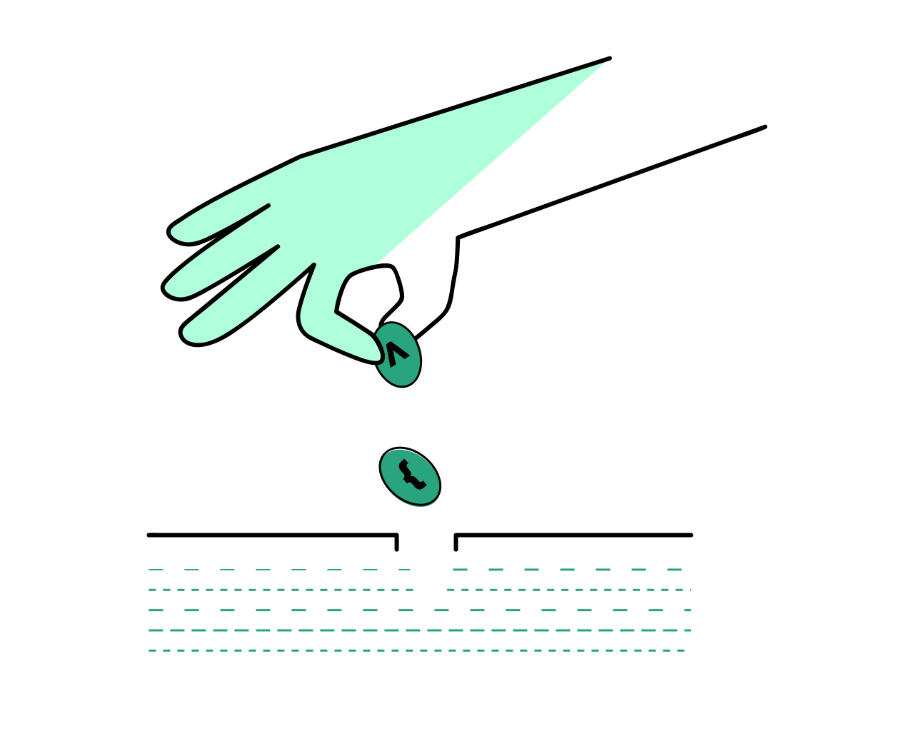

# [Parte 1 - Introducción a React](https://fullstackopen.com/es/part1)

En esta parte, nos familiarizaremos con la librería React, que usaremos para escribir el código que se ejecuta en el navegador. También veremos algunas características de JavaScript que son importantes para comprender React.
 

a.[Introducción a React](https://fullstackopen.com/es/part1/introduccion_a_react)

b.[Javascript](https://fullstackopen.com/es/part1/java_script)

c.[Estado del componente, controladores de eventos](https://fullstackopen.com/es/part1/estado_del_componente_controladores_de_eventos)

d.[Un estado más complejo, depurando aplicaciones React](https://fullstackopen.com/es/part1/un_estado_mas_complejo_depurando_aplicaciones_react)

